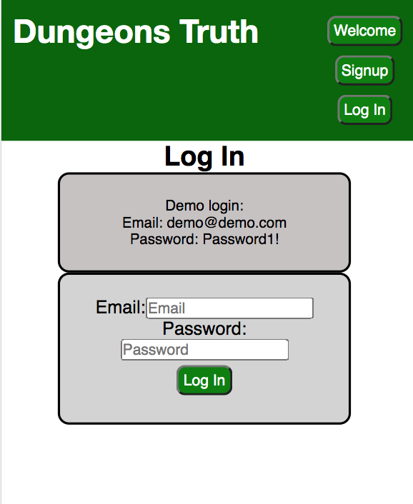
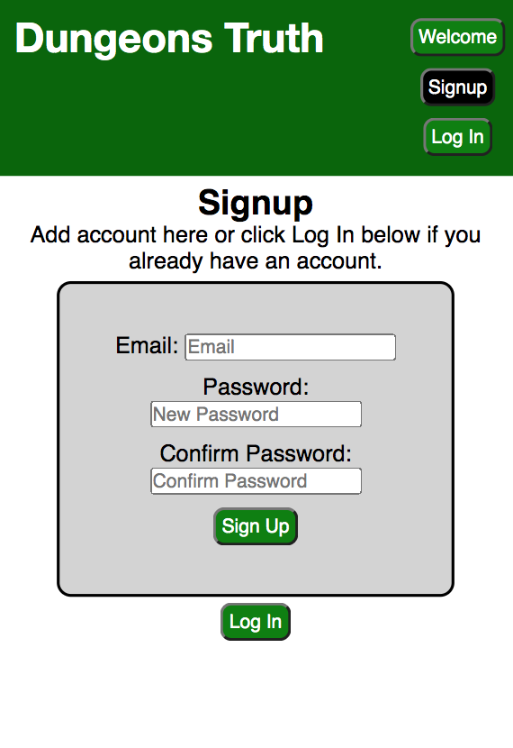

# Dungeons and Dragons Logging App

## Dungeons Truth

Tell your story your way.

Live app: (https://habit-app-omega.vercel.app/)

## Table of Contents

- Summary of App
- Screenshots of App in Use
- Technologies Used

## Summary

Dungeons Truth is an app that role playing game players can use to create a more rounded out experience when playing the game. When players can only meet when their whole party can play, it can be hard to remember every detail of the story. Dungeons Truth acts as a platform to log the players and characters experiences throughout the campaign. Upon log in users create a campaign that displays a code. Once the code is created all players can add themselves into the game on the same campaign code log their journey together. Users log their player information including name, character race, class, level, and any additional information they would like to track. On campaign log users can post publicly and privately taking down towns they have traveled to, who they meet, what creatures they fight, and magical objects they pick. As campaigns can take weeks to months to years it is hard to remember everything the players and characters have gotten up to in their journey. Log in and tell your story with Dungeons Truth.

### Screenshots

## Technologies Used

- Node.js (v. 12.18.3)
- React.js (v. 17.0.1)
- PostgreSQL (v. 12.4)
- Express (v. 4.17.1)
